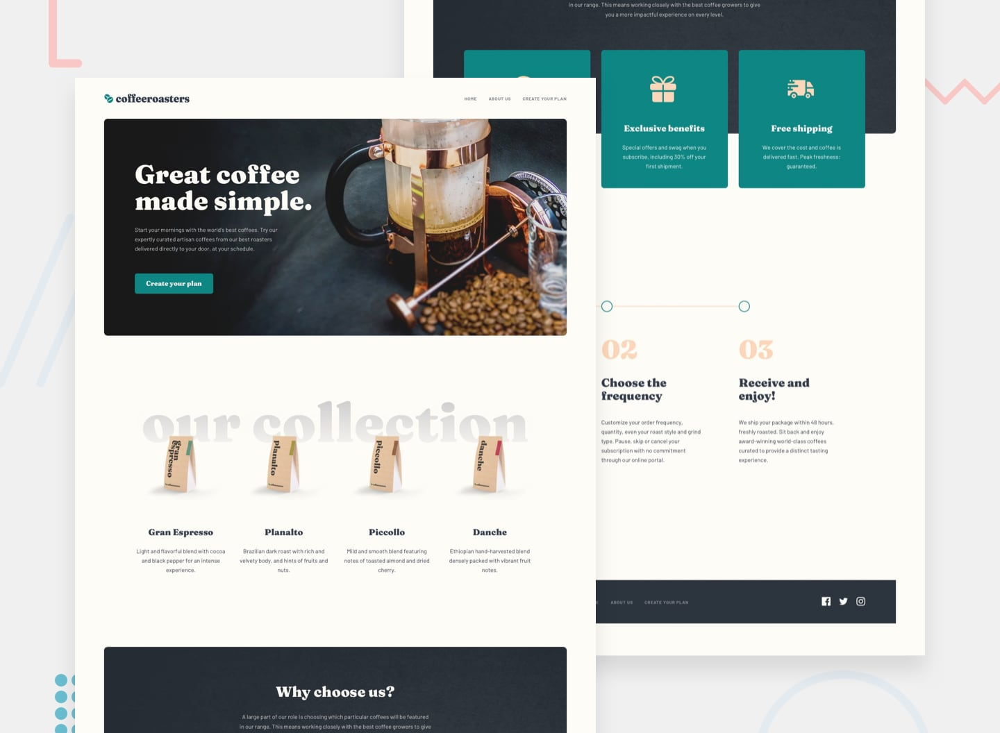

# Sunnyside agency landing page solution

**To do this challenge, you need a basic understanding of HTML, CSS and JavaScript.**

## The challenge

Your challenge is to build out this landing page and get it looking as close to the design as possible.

This challenge focuses mostly on HTML & CSS. There's a tiny bit of JS included for the mobile navigation toggle. But you could also choose to do this without JS!

You can use any tools you like to help you complete the challenge. So if you've got something you'd like to practice, feel free to give it a go.

Your users should be able to:

- View the optimal layout for the site depending on their device's screen size
- See hover states for all interactive elements on the page

## Where to find everything

Your task is to build out the project to the designs inside the `/design` folder. You will find version of the design.

The designs are in JPG static format. Using JPGs will mean that you'll need to use your best judgment for styles such as `font-size`, `padding` and `margin`.

You will find all the required assets in the `/starter-code/assets` folder. The assets are already optimized.

### Links

- Solution URL: [Add solution URL here](https://your-solution-url.com)
- Live Site URL: [Add live site URL here](https://your-live-site-url.com)

## Built With ❤ 

- Semantic HTML5 markup
- CSS custom properties
- Flexbox
- CSS Grid
- Mobile-first workflow

### Useful resources

- [Everthing developers need to know about figma](https://www.smashingmagazine.com/2020/09/figma-developers-guide/)
- [Introduction to figma for developers](https://www.learnwithjason.dev/introduction-to-figma-for-developers)- This helped me to learn figma concepts. 
- [Flexbox](https://developer.mozilla.org/en-US/docs/Learn/CSS/CSS_layout/Flexbox) - This helped me to learn flexbox concepts. 
- [CSS3 properties](https://css-tricks.com/almanac/properties/) - A list with common CSS3 properties.

## Author

* **Daedra** - - [Daedra](https://github.com/Any28Flo)

## Acknowledgments

[Frontend Mentor](https://www.frontendmentor.io) challenges help me improve my coding skills by building realistic projects.